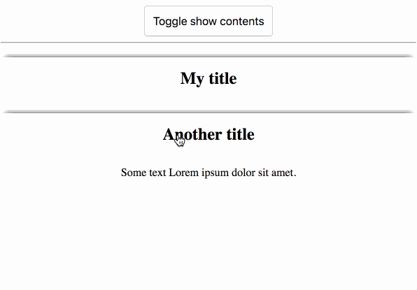
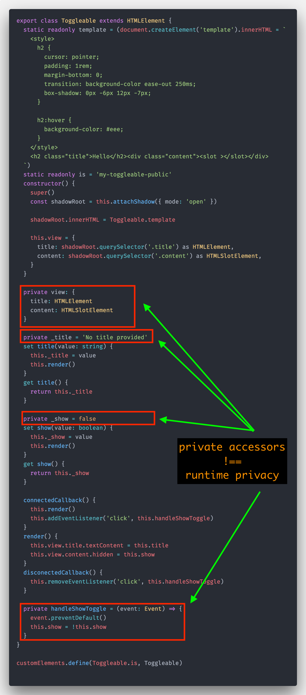
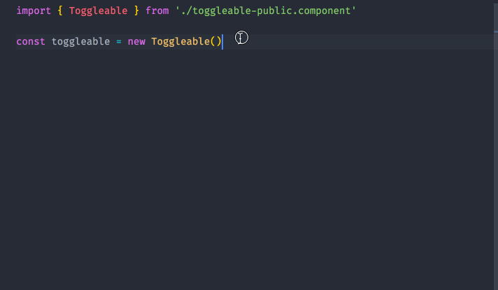
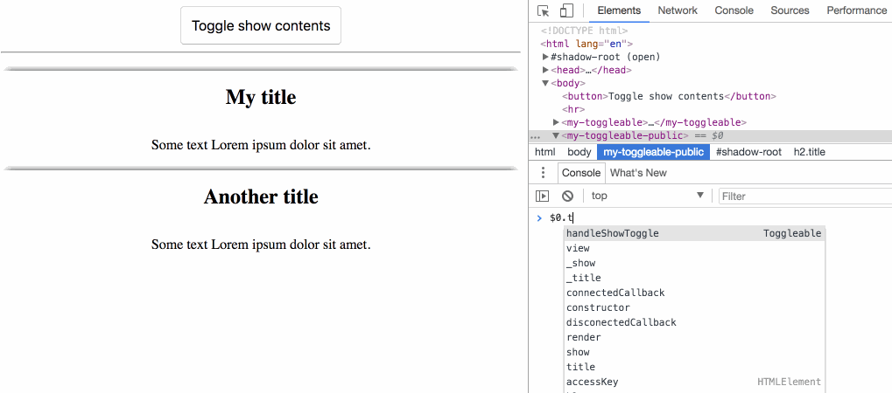
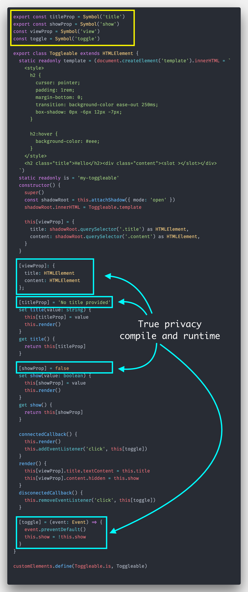
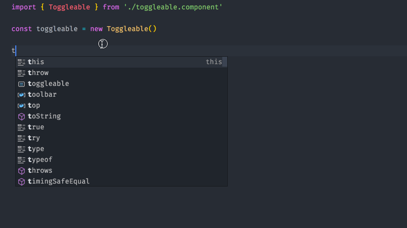
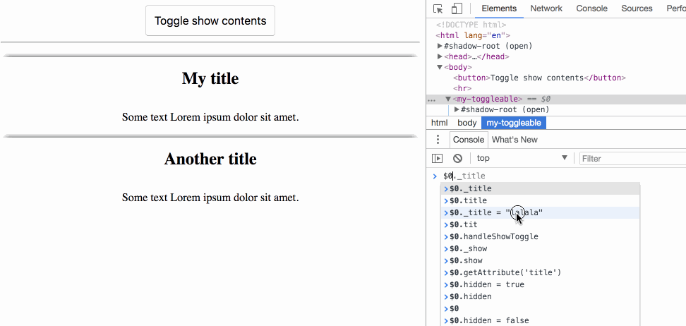

# Type-safe WebComponents with private properties with TypeScript 2.7

Hey everyone! As you've may noticed, TypeScript 2.7 was released not that long time ago, neverheless it brings a lot of new features to the table.

In this article we will focus primarily on [**Unique Symbol Types**](https://github.com/Microsoft/TypeScript/pull/15473) support, in particular within ES2015 classes, which are also a main building blocks of WebComponents.

For our demonstration purpose, we will implement a simple `Toggleable Custom Element` with following featurs:

* it is both stateful and controllable component
* public API contains of 2 props: `title` and `show` and content projection via `slot`
* onClick it will toggle visibility of projected content

**Usage:**

```html
<my-toggleable>
    <p>Some text Lorem ipsum dolor sit amet.</p>
</my-toggleable>
```

**Demo:**



Ok let's implement our `Toggleable` Custom Element:

As we know, standard pattern to impement Custom Element props is following

* internal "private" class property which keeps current property value
* getter to that "private" property for public use
* setter for "private" property for public use

So let's say for our `title` prop following needs to be implemented

```ts
class Toggleable extends HTMLElement {
  private _title = 'No title provided'
  set title(value: string) {
    this._title = value
    this.render()
  }
  get title() {
    return this._title
  }
}
```

**This is whole element, with various `private` accesors used:**



Because we are using TypeScript, we can annotate our internal property with `private` accessor. While this will indeed mitigate the direct access from our TypeScript files, it will be still present in the runtime, and because of that, it's not truly private! Whoops!

**Privacy during compile time**



**Privacy is gone during runtime time**



So now what?

---

Well there are private properties coming soon to EcmaScript classes but are not there yet.

Until then we can use `Symbol` primitive type in combination with `class/object dynamic property definition`. This technique wasn't possible before with TypeScript, thankfully [TS 2.7 adds this feature](https://github.com/Microsoft/TypeScript/pull/15473).

First let's define our private symbols for all private properties:

```ts
const titleProp = Symbol('title')
const showProp = Symbol('show')
const viewProp = Symbol('view')
const toggle = Symbol('toggle')
```

Now our `title` CustomElement API definition will look following:

```ts
class Toggleable extends HTMLElement {
  [titleProp] = 'No title provided'
  set title(value: string) {
    this[titleProp] = value
    this.render()
  }
  get title() {
    return this[titleProp]
  }
}
```

**This is whole custom element implementation, with true compile and runtime privacy for particular props:**



**Privacy during compile time**



**Privacy during runtime time**



Note:

As we saw in the gif you cannot create identical symbol by yourself and access the class dynamic property, because Symbols are always unique! Only possible way how to access our private properties is by exporting those symbols and use them as a refference. But in real life, there isn't a valid use case to do that, so please don't ;)

Nice, isn't it ?

Stay type-safe and truly private within your WebComponent or Class implementations thanks to latest additions to TypeScript 2.7

As always, don't hesitate to ping me if you have any questions here or on twitter (my handle [@martin_hotell](https://twitter.com/martin_hotell)) and besides that, happy type checking folks and 'till next time! Cheers!
