# 10 TypeScript Pro tips with (or without) React

> 🎒 this article uses following library versions:

```json
{
  "@types/react": "16.4.18",
  "@types/react-dom": "16.0.9",
  "typescript": "3.1.3",
  "react": "16.5.2",
  "react-dom": "16.5.2"
}
```

> 🎮 [source code can be found on my github profile](https://github.com/Hotell/blogposts/tree/master/2018-10/ten-ts-tips-with-react)

---

TypeScript is definitely the best thing that happened to JavaScript. period.

Unfortunately, I cannot say the same about "The best thing that happened to Java/C# devs writing JavaScript with it 👀😳🌀⏱"

Why 🤨?

Well, it definitely makes your Java/C# ego feel like at home, having types within JavaScript (which is amazing !), but then it introduces other "language features" which are not part of standard JavaScript, and because of those, it may throw a false prejudice about TypeScript, by putting it to a "Completely new language" bag, which isn't really true IMHO.

I've been always trying to stay away from various TS features (for a good reasons btw.) to stay in Idiomatic/Standard JavaScript space as much as possible.

This article describes various patterns/tips that I "invented/learned" and have been using while using TypeScript and React for building UI's.

> Initially, this blog post introduced "only" 10 tips, I may add additional ones in the future. Definitely check this post time to time for any updates 😎

Whole article is written in a "Style guide style" with 3 sub-categories for every tip/pattern which consists of:

- **Don't** ( code example what you shouldn't be doing)
- **Do** or **Good/Better** (code example what you should be doing)
- **Why** (reasoning/explanation)

With that covered, let's hop into 10 TypeScript Pro tips/patterns with ( or without ) React.

---

## 1. Don't use `public` accessor within classes

**Don't:**

```tsx
class App extends Component {
  public handleChange() {}
  public render() {
    return <div>Hello</div>
  }
}
```


**Do:**

```tsx
class App extends Component {
  handleChange() {}
  render() {
    return <div>Hello</div>
  }
}
```

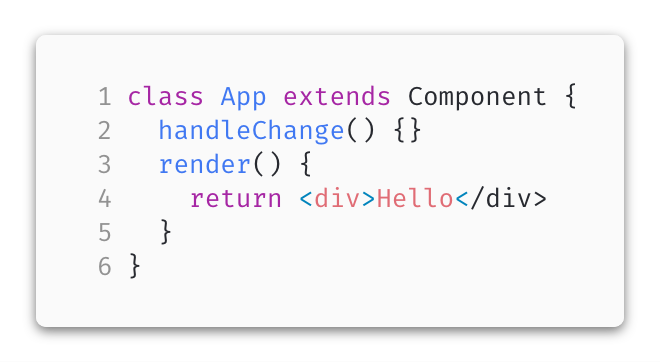

**Why?**

All members within class are `public` by default (and always public in runtime, TS private/protected will "hide" particular class properties/methods only during compile time). Don't introduce extra churn to your codebase. Also using `public` accessor is not "valid/idiomatic javascript"

## 2. Don't use `private` accessor within Component class

**Don't:**

```tsx
class App extends Component {
  private handleChange = (ev: import('react').ChangeEvent) => {}
  render() {
    return (
      <div>
        <input onChange={this.handleChange} />
      </div>
    )
  }
}
```

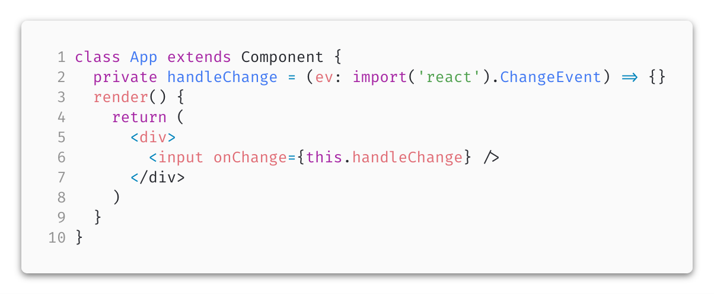

**Good:**

```tsx
class App extends Component {
  _handleChange = (ev: import('react').ChangeEvent) => {}
  render() {
    return (
      <div>
        <input onChange={this._handleChange} />
      </div>
    )
  }
}
```

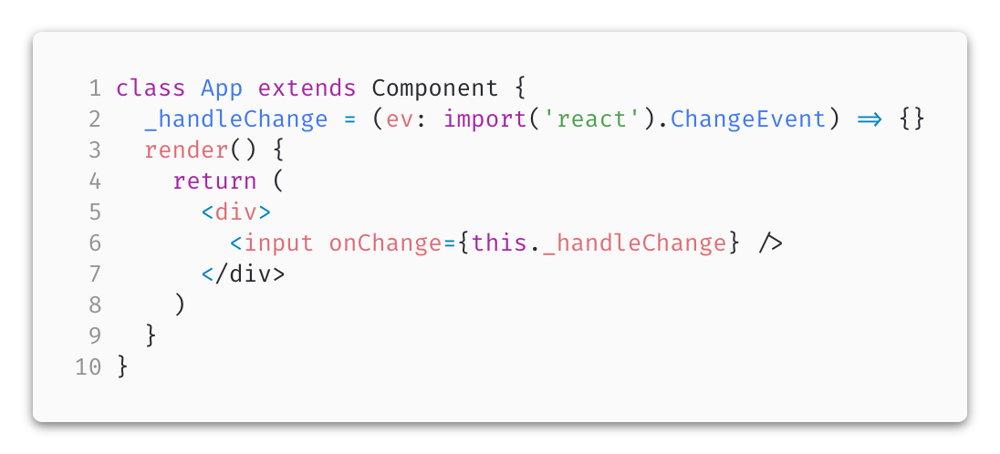

**Better:**

```tsx
const handleChange = Symbol()

class App extends Component {
  // private property via symbol
  [handleChange] = (ev: import('react').ChangeEvent) => {}

  render() {
    return (
      <div>
        {/*private property access via symbol ref with proper type safety*/}
        <input onChange={this[handleChange]} />
      </div>
    )
  }
}
```


**Why:**

`private` accessor won't make your properties/methods on class private during runtime. It's just TypeScript "emulation during compile time". Don't get fooled and make things "private" by using well known patterns like:

- name starting with underscore 👉 `_someProp`
- or if you really wanna make those properties private use `Symbol` for defining those. ( [real runtime private properties are coming to ECMAscript](https://github.com/bloomberg/TypeScript/pull/6) )

In reality, you should almost never need to work directly with React Component instance nor accessing its class properties.

## 3. Don't use `protected` accessor within Component class

**Don't**

```tsx
type BaseProps = { config: object; who: string }

class Base extends Component<BaseProps> {
  protected renderInnerContent(config: BaseProps['config']) {
    return (
      <>
        <p>Lorem Ipsum</p>
        <pre>{JSON.stringify(config)}</pre>
      </>
    )
  }
}

class SomeFeature extends Base {
  render() {
    return <div>{this.renderInnerContent(this.props)}</div>
  }
}
```


**Do**

```tsx
class InnerContent extends Component<{ config: object }> {
  render() {
    return (
      <>
        <p>Lorem Ipsum</p>
        <pre>{JSON.stringify(this.props.config)}</pre>
      </>
    )
  }
}

type Props = { who: string } & InnerContent['props']
class SomeFeature extends Component<Props> {
  render() {
    return (
      <div>
        <InnerContent config={this.props.config} />
      </div>
    )
  }
}
```


**Why:**

Using `protected` is an immediate "RED ALERT" 🚨🚨🚨 in terms of functional patterns leverage with React. There are more effective patterns like this for extending behaviour of some component. You can use:

- just extract the logic to separate component and use it as seen above
- **HoC** (high order function) and **functional composition**.
- **CaaF** ( children as a function )

## 4. Don't use `enum`

**Don't:**

```tsx
enum Response {
  No,
  Yes,
}

function respond(recipient: string, message: Response): void {
  // ...
}

enum Colors {
  Red = 'RED',
  Green = 'GREEN',
  Blue = 'BLUE',
}

function favoriteColor(name: string, color: Colors) {
  // ...
}
```


**Good:**

If you need to support runtime enums use following pattern:

```tsx
type EnumLiteralsOf<T extends object> = T[keyof T]

// merge implementation with "Enum" typed literal
// $ExpectType 1 | 2
export type Response = EnumLiteralsOf<typeof Response>
// $ExpectType Readonly<{ No: 1; Yes: 2; }>
export const Response = Object.freeze({
  // we need to explicit cast values to get proper literal type
  No: 1 as 1,
  Yes: 2 as 2,
})

function respond(recipient: string, message: Response) {
  // ...
}

// merge implementation with "Enum" typed literal
// $ExpectType "RED" | "GREEN" | "BLUE"
export type Colors = EnumLiteralsOf<typeof Colors>
// $ExpectType Readonly<{ Red: "RED"; Green: "GREEN"; Blue: "BLUE"; }>
export const Colors = Object.freeze({
  Red: 'RED' as 'RED',
  Green: 'GREEN' as 'GREEN',
  Blue: 'BLUE' as 'BLUE',
})

function favoriteColor(name: string, color: Colors) {
  // ...
}
```

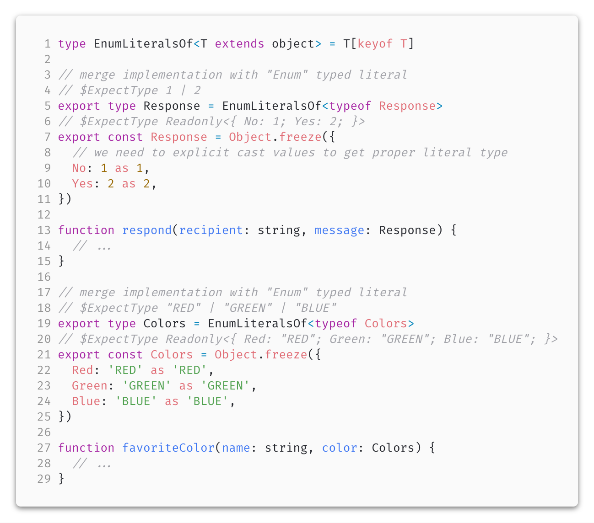

**Better:**

If you don't need to support runtime enums, all you need to use are type literals:

```tsx
type Response = 1 | 2

function respond(recipient: string, message: Response) {
  // ...
}

type Colors = 'RED' | 'GREEN' | 'BLUE'

function favoriteColor(name: string, color: Colors) {
  // ...
}
```


**Why?**

To use `enum` within TypeScript might be very tempting, especially if you're coming from language like C# or Java. But there are better ways how to interpret both with well known JS idiomatic patterns or as can be seen in "Better" example just by using compile time **type literals**.

- Enums compiled output generates unnecessary boilerplate (which can be mitigated with `const enum` though. Also string enums are better in this one)
  - 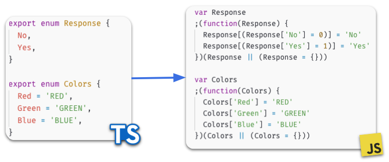
- Non string Enums don't narrow to proper number type literal, which can introduce unhandled bug within your app
  - 
- It's not standard/idiomatic JavaScript (although `enum` is reserved word in ECMA standard)
- Cannot be used with babel for transpiling 👀

### Enum helper

In our "Good" example, you might think like, ugh that's a lot of boilerplate dude! I hear you my friends. Loud and clear 🙏

If you need to support runtime enums for various reasons, you can leverage small utility function from [rex-tils library](https://github.com/Hotell/rex-tils) like showcased here:

```tsx
import { Enum } from '@martin_hotell/rex-tils'

// merge implementation with "Enum" typed literal
// $ExpectType 'No' | 'Yes'
export type Response = Enum<typeof Response>
// $ExpectType Readonly<{ No: 'No'; Yes: 'Yes'; }>
export const Response = Enum('No', 'Yes')

function respond(recipient: string, message: Response) {
  // ...
}

// merge implementation with "Enum" typed literal
// $ExpectType "Red" | "Green" | "Blue"
export type Colors = Enum<typeof Colors>
// $ExpectType Readonly<{ Red: "Red"; Green: "Green"; Blue: "Blue"; }>
export const Colors = Enum('RED', 'GREEN', 'BLUE')

function favoriteColor(name: string, color: Colors) {
  // ...
}
```

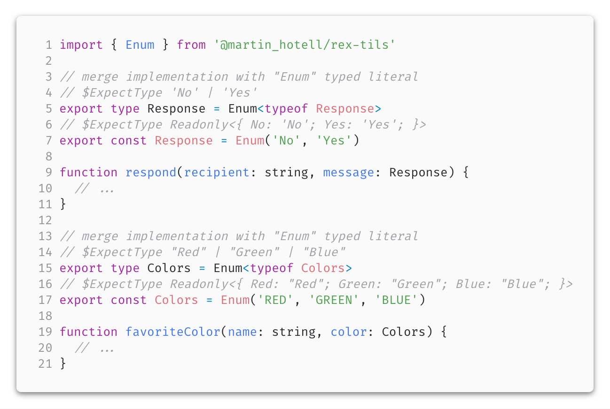

## 5. Don't use `constructor` for class Components

**Don't:**

```tsx
type State = { count: 0 }
type Props = {}

class Counter extends Component<Props, State> {
  constructor(props: Props) {
    // if you'll forget to call the super class constructor
    // bad things start to happen 🚨💥
    super(props)
    this.state = {
      count: 0,
    }
  }
}
```

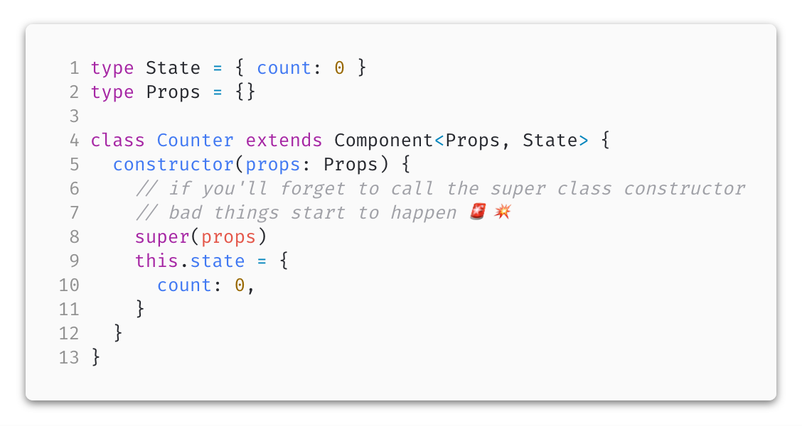

**Do:**

```tsx
type State = { count: number }
type Props = {}

class Counter extends Component<Props, State> {
  state = {
    count: 0,
  }
}
```

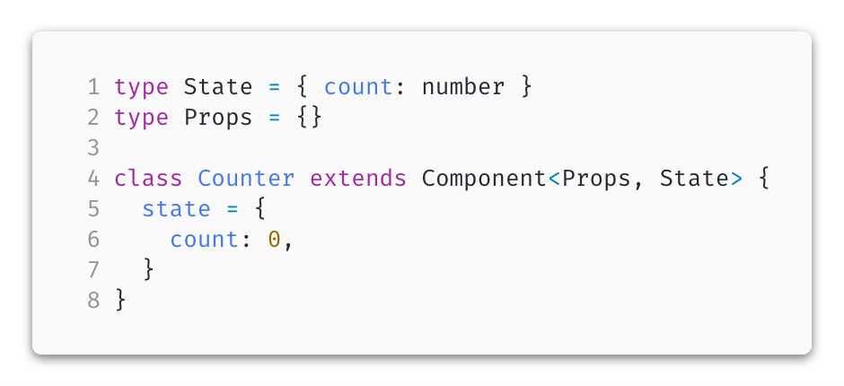

**Why:**

There is really no need to use constructor within React Component.

If you do so, you need to provide more code boilerplate and also need to call `super` with provided props ( if you forget to pass props to your super, your component will contain bugs as props will not be propagated correctly).

> But... but... hey ! React official docs use constructor!
> 👉 That's fine (React team uses current version of JS to showcase stuff)
>
> But... but..., class properties are not standard JavaScript!
> 👉 Class fields are in [Stage 3](https://github.com/tc39/proposal-class-fields#consensus-in-tc39), which means they are gonna be implemented in JS soon

### Initializing state with some logic

Of course you may ask, what if I need to introduce some logic to initialize component state, or even to initialize the state from some dependant values, like props for example.

Answer to your question is rather straightforward.

Just define a pure function outside the component with your custom logic (as a "side effect" you'll get easily tested code as well 👌).

```tsx
type State = { counter: number }
type Props = { initialCount: number }

const getInitialState = (props: Props): State => {
  /*some logic here*/ return {
    /*demanded object*/
  }
}

class App extends Component<Props, State> {
  state = getInitialState(this.props)
}
```

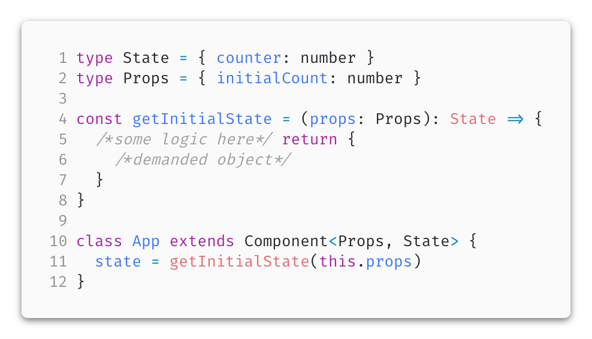

## 6. Don't use decorators for class Components

**Don't:**

```tsx
@connect(mapStateToProps)
export class Container extends Component {}
```


**Good:**

```tsx
const enhance = connect(mapStateToProps)

class Container extends Component {}

export default enhance(Container)
```

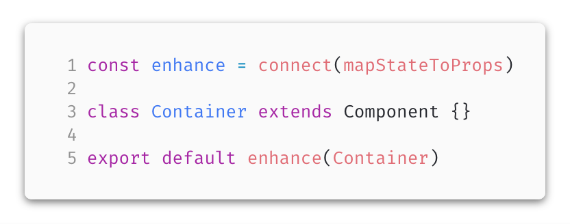

**Better:**

```tsx
import { compose } from 'redux'
import { connect } from 'react-redux'
import { translate } from 'react-i18n'

const enhance = compose(
  translate(),
  connect(mapStateToProps)
  // add as many HoC as you need. Functional composition FTW 👌
)

class Container extends Component {}

export default enhance(Container)
```

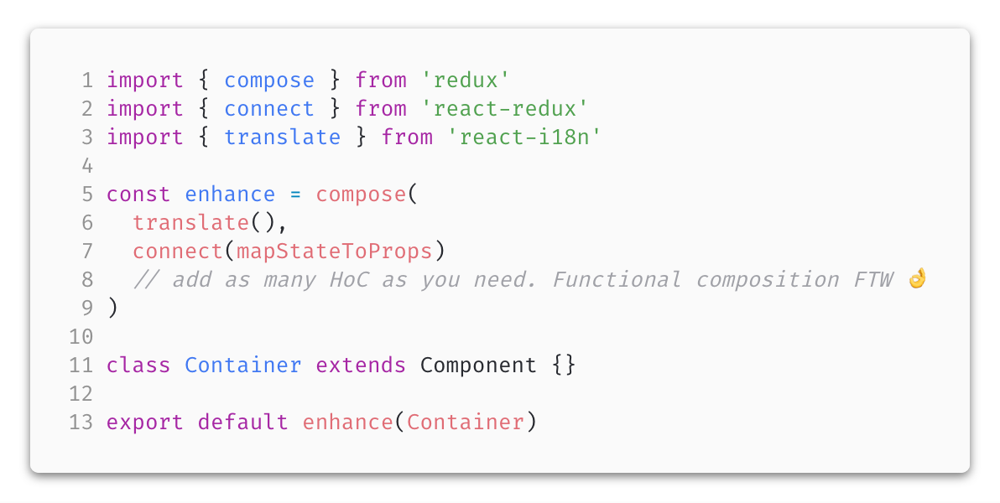

**Why:**

Decorators are parasitic 🐛 👀 🤢

- You won't be able to get original/clean version of your class.
- TypeScript uses old version of decorator proposal which isn't gonna be implemented in ECMAscript standard 🚨.
- It adds additional runtime code and processing time execution to your app.
- What is most important though, in terms of type checking within JSX, is, that decorators don't extend class type definition. That means (in our example), that our Container component, will have absolutely no type information for consumer about added/removed props.

## 7. Use _lookup types_ for accessing component State/Props types

> [lookup types](https://www.typescriptlang.org/docs/handbook/release-notes/typescript-2-1.html#keyof-and-lookup-types)

**Don't:**

```tsx
// counter.tsx
export type State = { counter: number }
export type Props = { someProps: string }

export class Counter extends Component<Props, State> {
  /*...some code*/
}

// consumer.tsx
import { Props, Counter } from './counter'
type SomeType = Props & {
  /* ... */
}

class Consumer extends Component {
  render() {
    return (
      <>
        <Counter />
      </>
    )
  }
}
```


**Do:**

```tsx
// counter.tsx
type State = { counter: number }
type Props = { someProps: string }

export class Counter extends Component<Props, State> {
  /*...some code*/
}

// consumer.tsx

// CLEANER API
import { Counter } from './counter'

// 🙇‍ USE LOOKUP TYPE
type SomeType = Counter['props'] & {
  /*...*/
}

class Consumer extends Component {
  render() {
    return (
      <>
        <Counter />
      </>
    )
  }
}
```

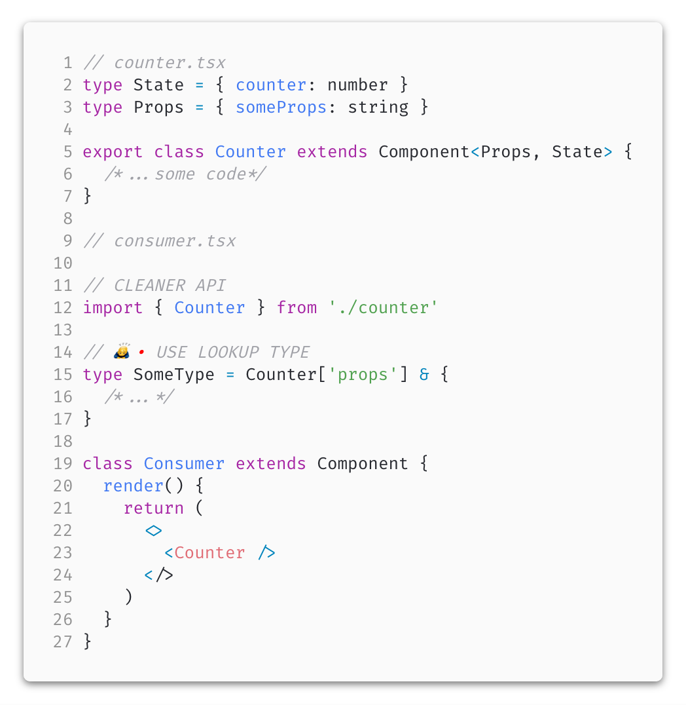

**Why:**

- Exporting Props or State from your component implementation is making your API surface bigger.
- You should always ask a question, why consumers of your component should be able to import explicit State/Props type? If they really need that, they can always access it via type lookup functionality. So cleaner API but type information is still there for everyone. Win Win 💪
- If you need to provide a complex Props type though, it should be extracted to `models/types` file exported as Public API.

## 8. Always provide explicit type for `children` Props

**Don't:**

```tsx
// button.tsx

import React, { Component } from 'react'

class Button extends Component {
  render() {
    const { children } = this.props

    return <button>{children}</button>
  }
}

// user-detail.tsx

type Props = { id: string; name: string; email: string }
class UserDetail extends Component<Props> {
  render() {
    const { id, email, name } = this.props
    return (
      <section>
        <h3>
          {name} : {id}
        </h3>
        <p>Email : {email}</p>
      </section>
    )
  }
}

// app.tsx

const App = () => (
  <main>
    <Button>click</Button>
    <Button />
    <UserDetail id="421312" email="johnny@five.org" name="Johnny the Fifth" />
    <UserDetail id="421312" email="johnny@five.org" name="Johnny the Fifth">
      Who am I?
    </UserDetail>
  </main>
)
```


**Do:**

```tsx
// button.tsx

type Props = {
  children: children: import('react').ReactNode
}
class Button extends Component<Props> {
  render() {
    const { children } = this.props

    return <button>{children}</button>
  }
}

// user-detail.tsx

type Props = { id: string; name: string; email: string; children?: never }

class UserDetail extends Component<Props> {
  render() {
    const { id, email, name } = this.props
    return (
      <section>
        <h3>
          {name} : {id}
        </h3>
        <p>Email : {email}</p>
      </section>
    )
  }
}

// app.tsx

import {Button} from './button'
import {UserDetail} from './user-detail'

const App = () => (
  <main>
    <Button>click</Button>
    {/* $ExpectError 👉 Button needs to have children */}
    <Button />
    <UserDetail id="421312" email="johnny@five.org" name="Johnny the Fifth" />
    {/* $ExpectError 👉  UserDetail cannot use children */}
    <UserDetail id="421312" email="johnny@five.org" name="Johnny the Fifth">
      Who am I?
    </UserDetail>
  </main>
)
```

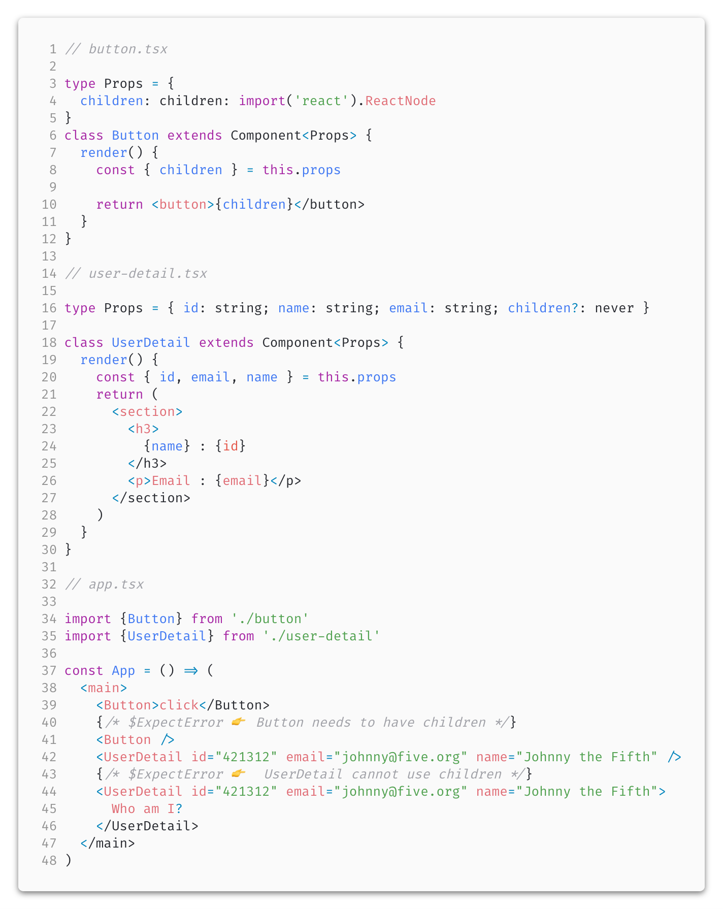

**Why:**

- `children` prop is annotated as optional within both Component and Functional Component in `react.d.ts` which just mirrors the implementation how React handles children.
  While that's ok and everything, I prefer to be explicit with component API.

- if you plan to use `children` for content projection, make sure to explicit annotate it with type of your choosing and in opposite, if your component doesn't use it, prevent it's usage with `never` type.

### Children type constraint

> Hey, mister Skateboarder ! I have a question ✋:

What types can be used for `children` annotation in TypeScript ? I mean, can I constraint children to be only a particular type of Component ([like is possible with Flow](https://flow.org/en/docs/react/children/#toc-only-allowing-a-specific-element-type-as-children)) ? Something like `Tab` within `Tabs` `children: Tab[]` ?

Unfortunately not 🙃, as TypeScript isn't able to "parse" output of `JSX.factory` 👉 `React.createElement` which returns `JSX.Element` from global namespace, which `extends React.ReactElement<any>` so what compiler gets is an object type, with type checking turned off (WARNING:every time you `any` a kitten dies 🙀😅)

Or as stated in TypeScript docs:

> _"By default the result of a JSX expression is typed as `any`. You can customize the type by specifying the JSX.Element interface. However, it is not possible to retrieve type information about the element, attributes or children of the JSX from this interface. **It is a black box** ⬛️ 📦."_

> NOTE: TS 2.8 introduced [locally scoped JSX namespaces](https://www.typescriptlang.org/docs/handbook/release-notes/typescript-2-8.html#locally-scoped-jsx-namespaces), which may help to resolve this feature in the future. Watch this space!

We can use following types for annotating `children``:

- `ReactNode` | `ReactChild` | `ReactElement`
- `Array<ReactNode>` | `Array<ReactChild>` | `Array<ReactElement>`
- `object` | `{[key:string]:unknown}` | `MyModel`
- `Array<T>`
- primitives `string` | `number` | `boolean`
- `never` | `null` | `undefined` ( null and undefined doesn't make much sense though )

## 9. Use type inference for defining Component State or DefaultProps

**Don't:**

```tsx
type State = { count: number }
type Props = { someProps: string } & DefaultProps
type DefaultProps = { who: string }

export class Counter extends Component<Props, State> {
  static defaultProps: DefaultProps = { who: 'Johnny 5' }
  state = {
    count: 0,
  }
}
```


**Good:**

```tsx
// $ExpectType { count: number; }
type State = typeof initialState
// $ExpectType { someProps: string; } & { who: string; }
type Props = { someProps: string } & typeof defaultProps

const initialState = { count: 0 }
const defaultProps = { who: 'Johnny 5' }

export class Counter extends Component<Props, State> {
  static defaultProps = defaultProps
  state = initialState
}
```


**Better:**

By making freezing initialState/defaultProps, type system will infer correct `readonly` types (when someone would accidentally set some value, he would get compile error). Also marking both `static defaultProps` and `state` as `readonly` within the class, is a nice touch, to prevent us from making any runtime errors when incorrectly setting state via `this.state = {...}`

```tsx
// $ExpectType Readonly<{ count: number; }>
type State = typeof initialState
// $ExpectType { someProps: string; } & Readonly<{ who: string; }>
type Props = { someProps: string } & typeof defaultProps

const initialState = Object.freeze({ count: 0 })
const defaultProps = Object.freeze({ who: 'Johnny 5' })

export class Counter extends Component<Props, State> {
  static readonly defaultProps = defaultProps
  readonly state = initialState
}
```


**Why:**

- Type information is always synced with implementation as source of truth is only one thing 👉 THE IMPLEMENTATION! 💙
- Less type boilerplate
- More readable code
- by adding readonly modifier and freezing the object, any mutation within your component will immediately end with compile error, which will prevent any runtime error = happy consumers of your app!

### What if I wanna use more complicated type within state or default props?

Use `as` operator to cast your properties within the constant.

Example:

```tsx
import { Todo } from './models'

// $ExpectType Readonly<{ todos: Todo[] | null; }>
type State = typeof initialState

const initialState = Object.freeze({ todos: null as null | Todo[] })
```


## 10. When using factories instead of classes for models, leverage declaration merging by exporting both type and implementation

**Don't:**

```tsx
// models.ts

export const Todo = (description: string) => ({
  id: String(Date.now()),
  done: false,
  description,
})

// consumer.ts

// Todo is only factory
import { Todo } from './models'
// we need to manually create Todo interface to be able to reference it
interface TodoModel extends ReturnType<typeof Todo> {}

const initialState = Object.freeze({ todos: null as null | TodoModel[] })

class App extends Component<{}, State> {
  readonly state = initialState
  handleTodoCreation = (description: string) => {
    const newTodo = Todo(description)
    // update state etc
  }
}
```


**Do:**

```tsx
// models.ts

export const Todo = (description: string) => ({
  id: String(Date.now()),
  done: false,
  description,
})

export interface Todo extends ReturnType<typeof Todo> {}

// =======================================================

// consumer.ts

// Todo is both factory and type
import { Todo } from './models'

const initialState = Object.freeze({
  // 1. Todo used as type
  todos: null as null | Todo[],
})

class App extends Component<{}, State> {
  readonly state = initialState
  handleTodoCreation = (description: string) => {
    // 2. Todo used as factory
    const newTodo = Todo(description)
    // update state etc
  }
}
```


**Why:**

- Less Boilerplate
- One token for both type and implementation / Smaller API
- Both type and implementation are in sync and most importantly, implementation is the source of truth

## 11. don't use namespace import to import `React`

**Dont:**

```ts
import * as React from 'react'
```

**Do:**

```ts
import React from 'react'
```

To support recommended behaviour you need to set following config within your tsconfig.json file:

```json
{
  "compilerOptions": {
    /* Enables emit interoperability between CommonJS and ES Modules via creation of namespace objects for all imports. Implies 'allowSyntheticDefaultImports'. */
    "esModuleInterop": true
  }
}
```

**Consider:**

```tsx
/** @jsx createElement */
import { createElement, Component } from 'react'

class MyComponent extends Component {
  render() {
    return <div>Hello!</div>
  }
}
```

> #### NOTE:
>
> with this style, syntax sugar for using Fragments 👉 `<></>` won't work. You need to import them explicitly and use via `<Fragment>...</Fragment>`.
> I like this approach more as it's explicit and I can add `key` whenever I want without introducing "too much" changes while doing refactoring.

Or if you wanna use the "consider" method in whole project without defining jsx pragma per file, you need to set following config within your tsconfig.json file:

```json
{
  "compilerOptions": {
    /* Specify the JSX factory function to use when targeting 'react' JSX emit, e.g. 'React.createElement' or 'h'. */
    "jsxFactory": "createElement"
  }
}
```

**Why:**

- It's confusing to import all contents from react library when you're not using them.
- It's more aligned to "idiomatic JS"
- You don't need to import types defined on `React` namespace like you have to do with `Flow` as TS support declaration merging 👌
- The "consider" example is even more explicit what is used within your module and may improve tree-shaking during compile time.

## 12. Don't use `namespace`

**Dont:**

```ts
namespace Validation {
  export interface StringValidator {
    isAcceptable(s: string): boolean
  }

  export class LettersOnlyValidator implements StringValidator {
    isAcceptable(s: string) {
      /*...implementation */
    }
  }

  export class ZipCodeValidator implements StringValidator {
    isAcceptable(s: string) {
      /*...implementation */
    }
  }
}
```

**Do:**

```ts
export interface StringValidator {
  isAcceptable(s: string): boolean
}

export class LettersOnlyValidator implements StringValidator {
  isAcceptable(s: string) {
    /*...implementation */
  }
}

export class ZipCodeValidator implements StringValidator {
  isAcceptable(s: string) {
    /*...implementation */
  }
}
```

**Why:**

- `namespace` was kinda useful in pre ES2015 modules era. We don't need it anymore.
- Cannot be used with babel for transpiling 👀

If you really need some kind of namespacing within your module, just use idiomatic JavaScript, like in following example:

```ts
interface StringValidator {
  isAcceptable(s: string): boolean
}

class LettersOnlyValidator implements StringValidator {
  isAcceptable(s: string) {
    /*...implementation */
  }
}

class ZipCodeValidator implements StringValidator {
  isAcceptable(s: string) {
    /*...implementation */
  }
}

// idiomatic JS namespace via object
export const Validation = {
  LettersOnlyValidator,
  ZipCodeValidator,
}

// merge types with implementation namespace
export interface Validation {
  StringValidator: StringValidator
}

// ===============
// consumer.ts

import { Validation } from './validation'

// Validators to use
let validators: { [s: string]: Validation.StringValidator } = {}
validators['ZIP code'] = new Validation.ZipCodeValidator()
validators['Letters only'] = new Validation.LettersOnlyValidator()
```

## 13. Don't use ES2015 module imports when importing types without any run-time code

**Don't:**

```tsx
// counter.helpers.ts

// ❌ looks like we need some run-time entities, but we don't, those are just types
import { ChangeEvent } from 'react'
import { Counter } from './counter'

export const handleChange = (ev: ChangeEvent<HTMLInputElement>) => {
  // ...
}
export const increment = (state: Counter['state']) => ({
  count: state.count + 1,
})
export const decrement = (state: Counter['state']) => ({
  count: state.count + 1,
})
```

**Do:**

```tsx
// counter.helpers.ts

// ✅ no run-time imports needed as we are not using any!

export const handleChange = (
  ev: import('react').ChangeEvent<HTMLInputElement>
) => {
  // ...
}
export const increment = (state: import('./counter').Counter['state']) => ({
  count: state.count + 1,
})
export const decrement = (state: import('./counter').Counter['state']) => ({
  count: state.count + 1,
})
```

> ### NOTE:
>
> If you're having many duplicate imports, consider to aliasing them to local type
> 👉 type `State = import('./counter').Counter['state']`
>
> 👉 Beware that if you wanna create local type alias from generic type import, you need to mirror that generic type as well, e.g.: 👉 `type ReactElement<T=any> = import('React').ReactElement<T>`

**Why:**

- Your code is explicit for both human and machine. If you don't use any run-time code, annotate your code via only via `import('path')`
- [check this great post from David East](https://davidea.st/articles/typescript-2-9-import-types) to learn more

## 14. Don't use camelCase/PascalCase for file names

**Don't:**

```sh
SkaterBoy.tsx

userAccessHandlers.ts
```

**Do:**

```sh
skater-boy.tsx

user-access-handlers.ts
```

**Why:**

- readable file names. e.g `MyHalfFixedDedupedDirResolver` vs `my-half-fixed-deduped-dir-resolver` 👀
- no more weird git conflicts when renaming/deleting/adding files on various OS file systems (case-sensitive/insensitive)
- consistency (I don't have to think if this file is component or some helper or service. `tsx` extension tells me that)
- nicely maps to component implementation name `skater-boy.tsx` 👉 `const SkaterBoy = () => {}`

## 15. Declare types before run-time implementation

**Don't:**

```tsx
import { Component } from 'react'

const initialState = {
  count: 0,
}

const defaultProps = {
  color: 'red',
}

type State = typeof initialState
type Props = { count?: number } & typeof defaultProps

class Counter extends Component<Props, State> {
  static defaultProps = defaultProps
  state = initialState
}
```

**Do:**

```tsx
import { Component } from 'react'

// 1. types first
type State = typeof initialState
type Props = { count?: number } & typeof defaultProps

// 2. runtime  code after types
const initialState = {
  count: 0,
}
const defaultProps = {
  color: 'red',
}
class Counter extends Component<Props, State> {
  static defaultProps = defaultProps
  state = initialState
}
```

**Why:**

- first lines of document clearly state what kind of types are used within current module. Also those types are compile only code
- run-time and compile time declarations are clearly separated
- in component user immediately knows what the component "API" looks like without scrolling

> ### NOTE:
>
> If your leveraging declaration merging as part of your API, define type after implementation:

```tsx
// this is OK though! it's part of model public API
export const Todo = (description: string) => ({
  id: String(Date.now()),
  done: false,
  description,
})

export interface Todo extends ReturnType<typeof Todo> {}
```

---

## Summary

That's it for today! Hope you gonna apply those patterns sooner than later within your code base or even better use them as part of your project style guide. If you do, please lemme know how it goes!

[And remember. Respect, is everything! 😅](https://www.youtube.com/watch?v=EloDnA1_XEU)

Cheers!

---

As always, don't hesitate to ping me if you have any questions here or on Twitter (my handle [@martin_hotell](https://twitter.com/martin_hotell)) and besides that, happy type checking folks and 'till next time! Cheers! 🖖 🌊 🏄
